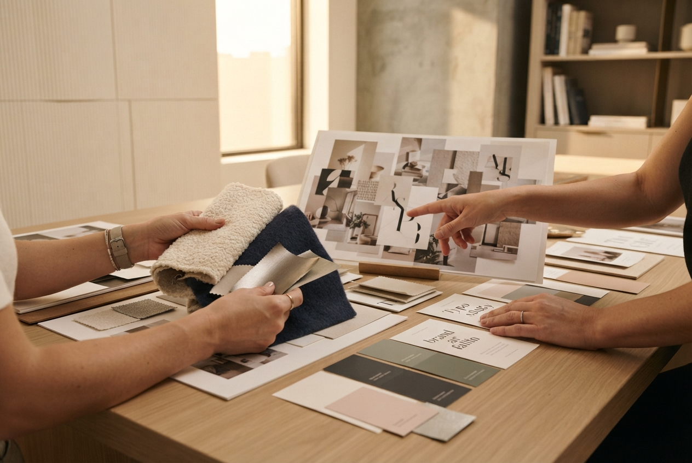
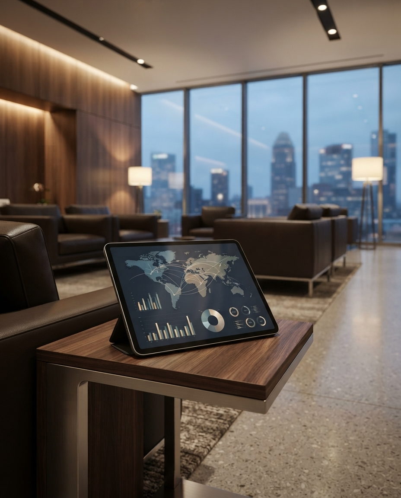
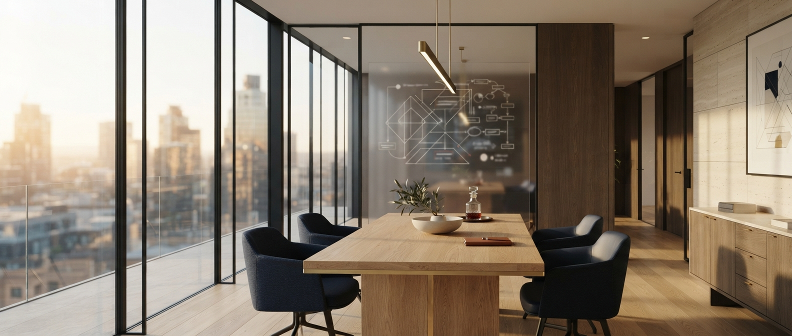
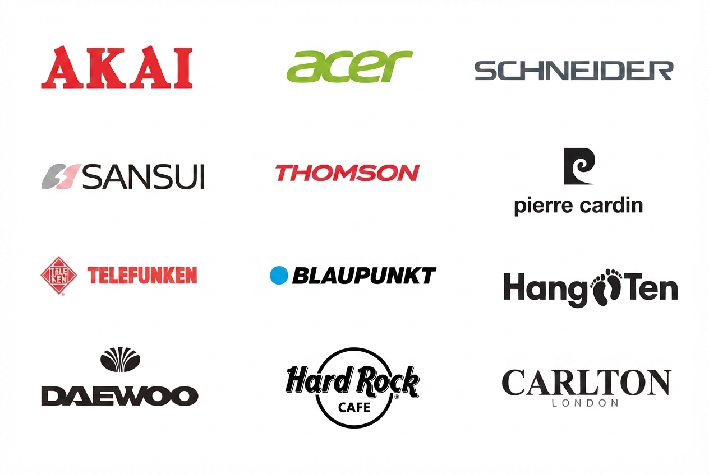

# 📸 Image Replacement Guide for GLAM Website

This document shows you where all the dummy placeholder images are located and how to replace them with real photos.

---

## 🎯 Current Dummy Images Added

### **HOME PAGE (index.html)**

#### 1. **Team/Office Photo** (Line ~69)
- **Current**: `https://placehold.co/1000x500/0a0e27/c9a961?text=GLAM+Office+%7C+Team+Meeting`
- **Suggested Photo**: Office space, team meeting, or corporate headquarters
- **Dimensions**: 1000px × 500px (2:1 ratio)
- **Replace with**:
```html

```

#### 2. **Why GLAM - 3 Images Grid** (Line ~211)
Three images showing your capabilities:
- **Image 1**: `Global+Partnerships` → Partnership meetings, handshakes, business discussions
- **Image 2**: `Brand+Strategy` → Strategy sessions, whiteboards, planning meetings
- **Image 3**: `Market+Expansion` → Market analysis, data, global operations
- **Dimensions**: 400px × 300px each
- **Replace with**:
```html



```

---

### **SERVICES PAGE (services.html)**

#### 3. **Services Banner** (Line ~44)
- **Current**: `Strategic+Brand+Services`
- **Suggested Photo**: Professional business setting, consulting meeting, or service delivery
- **Dimensions**: 1200px × 400px (3:1 ratio)
- **Replace with**:
```html

```

---

### **BRANDS PAGE (brands.html)**

#### 4. **Brand Portfolio Banner** (Line ~48)
- **Current**: `Our+Iconic+Brand+Partners`
- **Suggested Photo**: Brand logos collage, product showcase, or brand partnership event
- **Dimensions**: 1200px × 400px (3:1 ratio)
- **Replace with**:
```html

```

---

### **ABOUT PAGE (about.html)**

#### 5. **Global Journey - 5 Images** (Lines ~65-95)
Each journey item has its own image:

**A. Global Meetings**
- **Current**: `Global+Brand+Meetings`
- **Suggested Photo**: International meetings, conferences, brand owner discussions
- **Dimensions**: 600px × 400px
- **Replace with**: `images/global-meetings.jpg`

**B. Market Discovery**
- **Current**: `Market+Research+%26+Discovery`
- **Suggested Photo**: Market visits, retail tours, consumer research
- **Dimensions**: 600px × 400px
- **Replace with**: `images/market-discovery.jpg`

**C. Exhibitions & Events**
- **Current**: `Trade+Shows+%26+Exhibitions`
- **Suggested Photo**: Trade show booths, exhibition floors, event participation
- **Dimensions**: 600px × 400px
- **Replace with**: `images/exhibitions.jpg`

**D. Partner Visits**
- **Current**: `Factory+%26+Partner+Visits`
- **Suggested Photo**: Factory tours, manufacturing facilities, partner offices
- **Dimensions**: 600px × 400px
- **Replace with**: `images/partner-visits.jpg`

**E. The GLAM Team**
- **Current**: `GLAM+Team+Photo`
- **Suggested Photo**: Team photo, group shot, company culture
- **Dimensions**: 600px × 400px
- **Replace with**: `images/team-photo.jpg`

#### 6. **People & Culture Section** (Line ~156)
- **Current**: `GLAM+Global+Team+%7C+Building+Relationships`
- **Suggested Photo**: Team collaboration, networking events, relationship building
- **Dimensions**: 1000px × 400px
- **Replace with**:
```html

```

---

### **CONTACT PAGE (contact.html)**

#### 7. **Contact Banner** (Line ~43)
- **Current**: `Get+In+Touch+With+GLAM`
- **Suggested Photo**: Office contact area, reception, or communication theme
- **Dimensions**: 1000px × 350px
- **Replace with**:
```html

```

---

## 📂 Recommended Folder Structure

Create an `images` folder in your website directory:

```
GLAM WEBSITE/
├── images/
│   ├── glam-office.jpg
│   ├── partnership-1.jpg
│   ├── strategy-session.jpg
│   ├── market-analysis.jpg
│   ├── services-banner.jpg
│   ├── brand-portfolio.jpg
│   ├── global-meetings.jpg
│   ├── market-discovery.jpg
│   ├── exhibitions.jpg
│   ├── partner-visits.jpg
│   ├── team-photo.jpg
│   ├── team-culture.jpg
│   └── contact-banner.jpg
├── index.html
├── services.html
├── brands.html
├── about.html
├── contact.html
├── styles.css
└── script.js
```

---

## 🔄 How to Replace Images

### Step 1: Prepare Your Photos
1. Collect all your real photos
2. Resize them to the recommended dimensions (or close to it)
3. Name them according to the guide above
4. Place them in an `images/` folder

### Step 2: Update HTML Files
**Find this** (example from index.html):
```html

```

**Replace with**:
```html

```

### Step 3: Test
- Open your website in a browser
- Check that all images load correctly
- Make sure they look good on mobile devices

---

## 📏 Image Size Recommendations

| Image Type | Recommended Size | Aspect Ratio | Purpose |
|-----------|-----------------|--------------|---------|
| Hero/Banner | 1200×400px | 3:1 | Wide header images |
| Feature Image | 1000×500px | 2:1 | Main content images |
| Grid Images | 400×300px | 4:3 | Multiple image displays |
| Journey Cards | 600×400px | 3:2 | About page journey items |
| Team Photos | 1000×400px | 5:2 | Team/culture sections |

---

## 🎨 Photo Tips for Professional Look

1. **Consistent Style**: Use photos with similar lighting and color grading
2. **High Quality**: Use high-resolution photos (at least 72 DPI for web)
3. **Optimize Size**: Compress images for faster loading (use tools like TinyPNG)
4. **Professional Settings**: Use photos that show:
   - Clean, modern office spaces
   - Professional meetings and handshakes
   - International business settings
   - Team collaboration
   - Brand products/logos
5. **Avoid Stock Photo Look**: Use real photos of your team, offices, and events when possible

---

## ⚡ Quick Replace Script

If you want to replace all at once, use Find & Replace in your code editor:

1. Open each HTML file
2. Find: `https://placehold.co/` (or the full placeholder URL)
3. Replace with: `images/your-photo-name.jpg`
4. Update each instance individually

---

## 📸 Total Images Needed

- **Home Page**: 4 images (1 hero + 3 grid)
- **Services Page**: 1 image (banner)
- **Brands Page**: 1 image (banner)
- **About Page**: 6 images (5 journey + 1 culture)
- **Contact Page**: 1 image (banner)

**TOTAL: 13 images needed**

---

## 🚀 After Replacement

Once you've added real photos:
1. The website will look authentic and custom
2. Client will see it's professionally tailored
3. The design will match GLAM's actual brand identity
4. It won't look "AI-generated" anymore

---

**Need help?** If you have questions about image sizes, formats, or placements, just ask!
